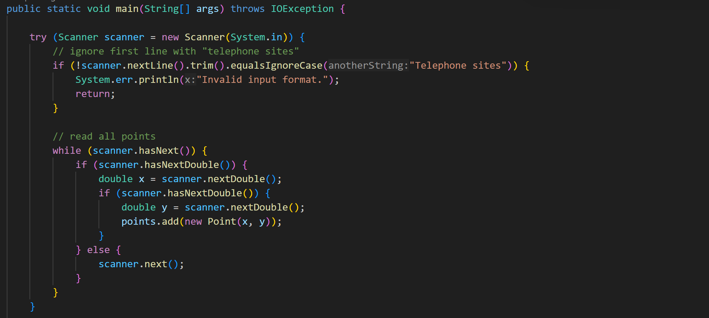
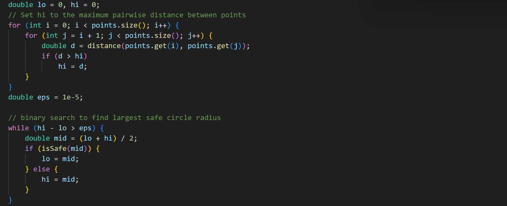
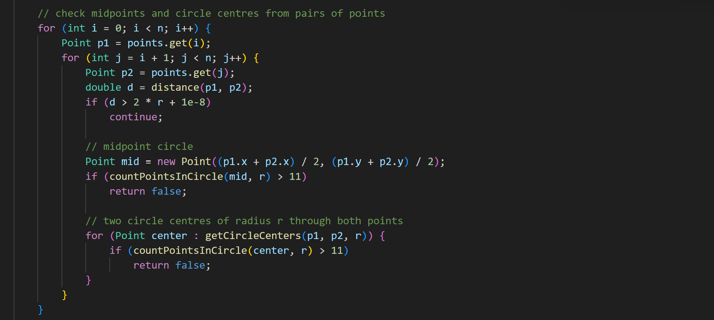

# Maximum Possible Circle for Telephones - Java Application
A Java application that, when given a list of telephone locations, finds the largest possible circle that never contains more than 12 telephones when placed anywhere in the area.

